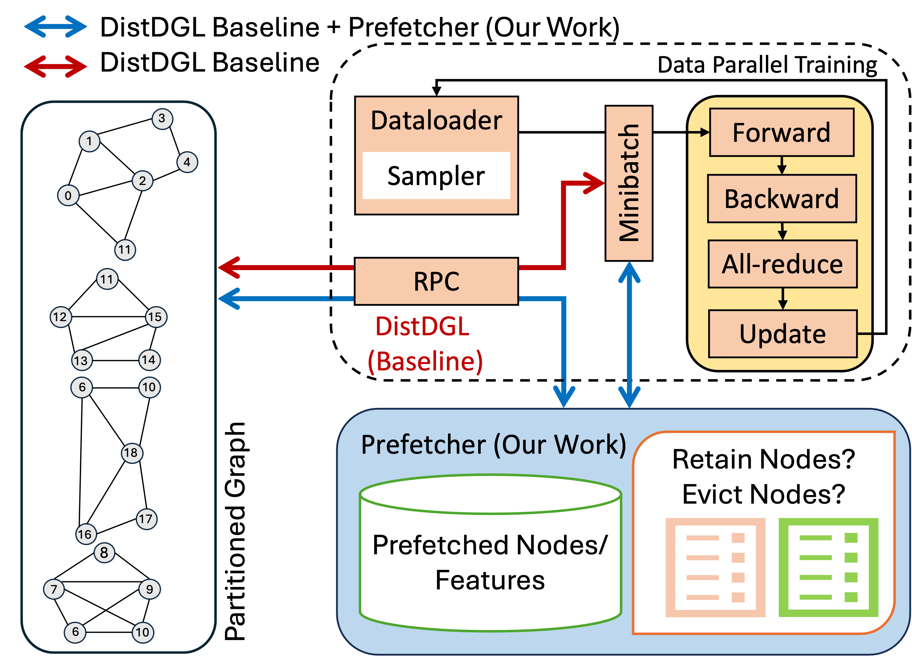

# MassiveGNN
<p align="center">
  
  <br>
  <b>Figure</b>: MassiveGNN Overall Architecture
</p>

## Description
MassiveGNN is a framework designed to accelerate the training of Graph Neural Networks (GNNs) on large-scale, massively connected distributed graphs. Built on top of DistDGL, it utilizes a dynamic prefetching and eviction strategy to optimize remote data fetching and processing and significantly reduces the training time for GNN models on distributed memory systems, enabling efficient and scalable training of large graph datasets.

## Getting Started

To install the required dependencies and DGL (Deep Graph Library), follow the steps below. If you wish to run MassiveGNN using DGL's container please refer to [this README](/slurm/pcluster-docker/README.md).

### Prerequisites

- Python 
- Torch with CUDA support
- DGL
- NUMBA


1. Clone the MassiveGNN repository:

    ```bash
    git clone https://github.com/yourusername/massivegnn.git
    cd massivegnn
    ```

2. Create and activate the conda environment using the provided `env.yml` file:

    **Note:** MassiveGNN has been tested on CUDA 11.7. If your CUDA version is 11.7, you can directly use the provided environment file. If your system has a different CUDA version, you may need to install DGL, Torch, and NUMBA separately according to your specific CUDA version.

    ```bash
    conda env create -f env.yml
    conda activate dgl-dev-gpu-117
    ```

3. If your CUDA version differs from 11.7, follow these steps to install DGL, Torch, and NUMBA separately:

    - Install DGL:
      Follow the instructions on the [DGL official installation page](https://www.dgl.ai/pages/start.html).

    - Install Torch:
      Visit the [PyTorch official site](https://pytorch.org/get-started/locally/) and select the appropriate configuration based on your CUDA version.

    - Install NUMBA:
      ```bash
      conda install numba
      ```

## Running MassiveGNN

### Partition graph  
This step partitions the graph dataset using the specified method and number of parts. Open Graph Benchmark (OGB) datasets are downloaded automatically.

#### Steps:

1. Navigate to the Partition Directory:
    ```bash
    cd ~/MassiveGNN/slurm/partition
    ```

2. Modify SLURM Directives:  
    Open the `partition.sh` script and update the SLURM directives (e.g., `account`, `time limit`, `constraint`) to match your environment’s requirements.

3. Submit the Job:
    ```bash
    sbatch partition.sh ogbn-arxiv metis "1 2" ~/MassiveGNN/dataset ~/MassiveGNN/partition/partition_graph.py ~/MassiveGNN/partitions
    ```
### Run MassiveGNN  
To run MassiveGNN on a distributed system, follow these steps:

1. Navigate to the MassiveGNN Directory:
    ```bash
    cd ~/MassiveGNN/slurm/massivegnn
    ```
2. Set Parameters:  
   The `set_params.sh` script is used to configure the parameters for running MassiveGNN. When you execute `set_params.sh`, it automatically calls `submit.sh`, which in turn submits the job based on your chosen configuration.

3. Choose Between CPU and GPU Execution:  
   - CPU Training: If you want to run MassiveGNN on CPU nodes, the job will be submitted through the `cpu.sh` script.
   - GPU Training: If you want to leverage GPUs for training, the job will be submitted through the `gpu.sh` script.

4. Update SLURM Directives:  
   Before running the scripts, you need to update the SLURM directives in the `cpu.sh` and `gpu.sh` scripts to match your cluster's configuration:
     - cpu.sh: Update this script with SLURM directives suited for running on CPU nodes (e.g., number of CPUs, memory, etc.).
     - gpu.sh: Update this script with SLURM directives for GPU nodes (e.g., number of GPUs, GPU type, etc.).

5. Run the script `set_params.sh`:  
   This script will set the necessary parameters and submit the job to SLURM. Depending on your arguments, the job will either be submitted to run on CPU nodes via `cpu.sh` or on GPU nodes via `gpu.sh`. After updating the SLURM directives, you can execute the `set_params.sh` script to start the job submission process:
    ```
    Usage: set_params.sh [MODE] [HIT_RATE] [MODEL] [FP] [DELTA] [ALPHAS] [DATASET_NAME] [NUM_NODES] [NUM_TRAINERS] [NUM_SAMPLER_PROCESSES] [QUEUE] [LOGS_DIR] [DATA_DIR] [PROJ_PATH] [PARTITION_DIR] [PARTITION_METHOD]

    Arguments:
      MODE                 Execution mode, either 'cpu' or 'gpu'.
      HIT_RATE             Hit rate flag, 'true' or 'false'.
      MODEL                Model name to be used. Currently accepts 'sage' or 'gat'.
      FP                   % halo nodes to prefetch while initializing buffer (e.g., '0.5').
      DELTA                Eviction interval.
      ALPHAS               Alpha value (e.g., '0.05'). Alpha is calculated as 1-delta.
      DATASET_NAME         Name of the dataset (e.g., 'ogbn-products').
      NUM_NODES            Number of nodes to be used (e.g., '2 4 8').
      NUM_TRAINERS         Number of trainers to be used.
      NUM_SAMPLER_PROCESSES Number of sampler processes to be used.
      QUEUE                SLURM queue name (e.g., 'regular' or 'debug').
      LOGS_DIR             Path to SLURM logs.
      DATA_DIR             Directory where the input graph data is stored.
      PROJ_PATH            Path to the project directory.
      PARTITION_DIR        Directory where the partitioned graphs are stored.
      PARTITION_METHOD     Method to partition the dataset (e.g., 'metis').
    ```
    Example:
    ```bash
    bash set_params.sh gpu true sage 0.25 32 0.005 ogbn-products 2 4 0 regular ~/MassiveGNN ~/MassiveGNN/dataset ~/MassiveGNN ~/MassiveGNN/partitions metis
    ```
    **Note:** To run the prefetch without eviction version set DELTA and ALPHA to 0.
    
## How to Cite
If you use MassiveGNN in your research, please cite our paper:
```
@inproceedings{massivegnn,
  title={MassiveGNN: Efficient Training via Prefetching for Massively Connected Distributed Graphs},
  author={Aishwarya Sarkar, Sayan Ghosh, Nathan R. Tallent, Ali Jannesari},
  booktitle={2024 IEEE International Conference on Cluster Computing (CLUSTER)},
  year={2024},
  organization={IEEE}
}
```